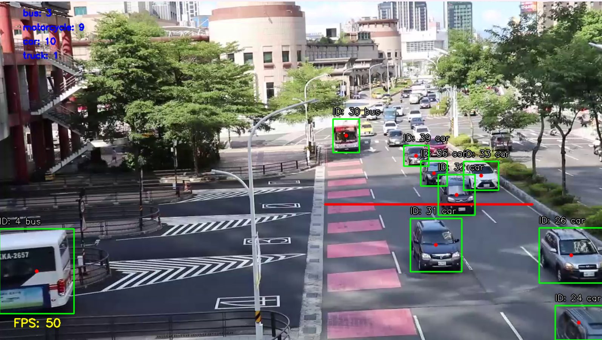

# CrossTracker

This project demonstrates real-time object tracking and counting using the YOLO (You Only Look Once) model and OpenCV. The program processes a video file to detect, track, and count objects that cross a predefined line. It provides visual enhancements such as dynamic color coding, FPS display, and detailed object information.

---

## Features

- **Object Detection**: Uses the YOLO model for accurate object detection and tracking.
- **Real-Time Tracking**: Tracks objects across frames using unique IDs.
- **Counting**: Counts objects that cross a specified line.
- **Visual Enhancements**:
  - Bounding boxes with color-coded details.
  - Object labels with shadowed text for better visibility.
  - FPS display on the video feed.
- **Dynamic Configuration**: Easily customize the parameters for object detection, colors, and display settings.

---

## Installation

### 1. Clone the Repository

```bash
git clone https://github.com/AmmarMohamed0/CrossTracker.git
cd CrossTracker
```

### 2. Install Dependencies

Make sure you have Python 3.7+ installed. Then, install the required packages:

```bash
pip install -r requirements.txt
```

## Configuration

All customizable parameters are stored in the `constants.py` file. Below are the key parameters you can adjust:

### Video and Model Paths:

- **VIDEO_FILE_PATH**: Path to the video file.
- **MODEL_PATH**: Path to the YOLO model file.

### Detection Parameters:

- **OBJECT_CLASSES**: List of classes to detect.
- **CROSSING_LINE_Y**: Y-coordinate of the line for counting.

### Display Settings:

- Colors, font size, and positions for text and shapes.

## Example Output


Example of object tracking and counting.
